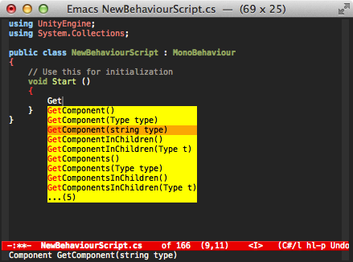
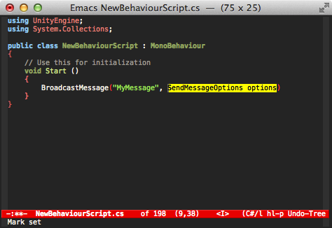

# omnisharp-emacs

omnisharp-emacs is a port of the awesome [OmniSharp][] server to the
Emacs text editor. It provides IDE-like features for editing files in
C# solutions in Emacs, provided by an OmniSharp server instance that
works in the background.

## Project maturity
Lacks a better UI and a good default configuration.

## Features

* Contextual code completion (i.e. auto-complete / IntelliSense) using
  [popup.el][] or [ido-mode][] or [company-mode][] if it is installed.
    * Popup.el and company-mode provide a more sophisticated
      interface, with the possibility to fall back on all of ido's
      flexible matching power.
    * Also shows documentation like other IDEs
* Show type of the current symbol in the minibuffer
* Navigation helpers
    * Go to definition of a type/variable/method etc.
    * Find usages of the current symbol in the solution
    * Find implementations/derived types of the current type
    * Go to definition of a type in the current file with [ido-mode][]
      (fast).
    * Go to definition of a member in the current type with
      [ido-mode][] (likewise fast :)).
* Rename the current symbol and all references to it
* Solution manipulation
    * Add/remove the current file
    * Add/remove selected files in the dired directory editor
* Override selected superclass member
* Run a refactoring on the current position
    * Uses the refactorings from the NRefactory library, which is also
      used by the MonoDevelop and SharpDevelop IDEs
* Solution building
    * The user may choose whether they want to build in the emacs
      `*compilation*` buffer or at OmniSharp's end (non-asynchronous,
      that is, blocking)
    * Jump to errors like in normal `*compilation*` output
* Format the current buffer
    * Currently only one formatting style supported, easy to add more.
* Syntax checker for parse errors
    * Can be run manually or using the provided [Flycheck][] checker
      in the background.
* OmniSharp server instance manipulation
    * Reload solution
    * Stop server

## Details

### Autocompletion

#### company-mode interface

To enable company-mode autocompletion, install company-mode and add
the following to your dotemacs:

`
(eval-after-load 'company
  '(add-to-list 'company-backends 'company-omnisharp))
`

company-mode showing parameters and function descriptions in the
minibuffer.



company-mode also allows for yasnippet-like template completion of method parameters.



#### popup.el interface


popup.el with documentation. The documentation may be disabled if you
need the screen space. There is an option to show documentation in a
help buffer.


#### Ido interface

Ido allows for flexible matching of all text that the completions
have. Each pressed character will narrow the list down to fewer
options. It's also possible to do a cross search at any point with a
new search term by pressing C-SPC.

This makes it really easy to e.g. narrow the list down to members that
handle a specific type, such as bool.


### Go to type in current file
This is a standard functionality in e.g. Visual Studio.


### Go to member in current type
This too is standard in various IDEs. Using ido makes navigating fast
and intuitive.


### Rename
Renaming suggests the current type as a basis.


### Overriding members
When invoked, displays a list of possible override targets.


When a target is chosen, a stub member is inserted.


### Refactoring suggestions
For now, this must be manually invoked. It can do different things
depending on the symbol under point. In this picture it has been
invoked on a method parameter.


### Solution building
Here is an example of an asynchronous build within Emacs. It works by
getting the build command from the backend and executing that in the
compilation buffer.


### Syntax errors checking
It is possible to check the current buffer for syntax errors using the
flycheck library. This is done asynchronously, and errors are shown
when found. Note that this is not a type checker, only syntax is
currently checked.


## Installation

This supports Emacs 24.3 and above at least. It has been tested on
Ubuntu 12.04 (Precise) and on Windows 7.

To install, use [MELPA][].
After MELPA is installed, use

```
M-x package-install omnisharp RET
```
to install.

omnisharp-emacs depends on the external program `curl` for accessing
the background OmniSharp server process. You need to ensure this is
installed and can be found by Emacs.

To automatically load omnisharp-emacs when editing csharp files, add
something like this to your csharp-mode-hook:

```
(add-hook 'csharp-mode-hook 'omnisharp-mode)
```

Start an OmniSharp server process on a solution, and you should have
access to all of this program's functions. You probably need to
create a custom configuration for accessing them in your normal
coding sessions.


* * * * *

Pull requests welcome!

[OmniSharp]: https://github.com/nosami/OmniSharpServer
[popup.el]: https://github.com/auto-complete/popup-el
[company-mode]: http://company-mode.github.io
[ido-mode]: http://www.emacswiki.org/emacs/InteractivelyDoThings
[Flycheck]: https://github.com/lunaryorn/flycheck
[MELPA]: http://melpa.milkbox.net/#installing
