# omnisharp-emacs

[](https://gitter.im/OmniSharp/omnisharp-emacs?utm_source=badge&utm_medium=badge&utm_campaign=pr-badge&utm_content=badge)
<a href="//travis-ci.org/OmniSharp/omnisharp-emacs">
    
</a>

omnisharp-emacs is a port of the awesome [OmniSharp][] server to the
Emacs text editor. It provides IDE-like features for editing files in
C# solutions in Emacs, provided by an OmniSharp server instance that
works in the background.

## This requires the [OmniSharp][] Server program
The server must be at least the following version (expect this to be
update to this guide whenever the required version changes):

```
c4a1b10d06765e5efa11c3591f096e6bdb6c1b5d
Date:   Sat Oct 18 23:08:19 2014 +0100
```

If you haven't updated your server copy since that, you must upgrade.

## Project maturity
Lacks a better UI and a good default configuration.

## Features

* Contextual code completion (i.e. auto-complete / IntelliSense) using
  [popup.el][] or [ido-mode][] or [company-mode][] if it is installed.
  Currently popup and ido-mode can complete symbols in all namespaces
  if so configured.
    * Popup.el and company-mode provide a more sophisticated
      interface, with the possibility to fall back on all of ido's
      flexible matching power.
    * Also shows documentation like other IDEs
* Show type of the current symbol in the minibuffer. With prefix
  argument, add it to kill ring. Optional eldoc support available to
  show this automatically when point is on a symbol (see the source
  for help)
* Navigation helpers
    * Go to definition of a type/variable/method etc. With the prefix
  argument (C-u), use another window.
    * Find usages of the current symbol in the solution
    * Find implementations/derived types of the current type
    * Go to definition of a type in the current file with [ido-mode][]
      (fast).
    * Go to definition of a member in the current type with
      [ido-mode][] (likewise fast :)).
    * Go to region / endregion in current file
    * Go to any member in the solution (property, method etc.)
    * Go to file, then go to member (type, property, method) in that
      file.
* Rename the current symbol and all references to it
    * Rename only semantic references ("smart" rename)
    * Rename as verbatim text ("dumb" rename)
* Solution manipulation
    * Add/remove the current file
    * Add/remove selected files in the dired directory editor
* Override selected superclass member
* Run a refactoring on the current position
    * Uses the refactorings from the NRefactory library, which is also
      used by the MonoDevelop and SharpDevelop IDEs
    * When used with a selection, prompts to extract a method from the
      selection where possible
* Solution building
    * The user may choose whether they want to build in the emacs
      `*compilation*` buffer or at OmniSharp's end (non-asynchronous,
      that is, blocking)
    * Jump to errors like in normal `*compilation*` output
* Format the current buffer
    * Currently only one formatting style supported, easy to add more.
* Fix using statements
    * Sorts, removes and adds any missing using statements
      for the current buffer
* Syntax checker for parse errors
    * Runs using the provided [Flycheck][] checker in the background.
* Syntax checker for code issues (refactoring suggestions)
    * This automatically runs when there are no syntax errors
    * Fix the first suggested error on the current line with
      `omnisharp-fix-code-issue-at-point`
* OmniSharp server instance manipulation
    * Start server
    * Reload solution
    * Stop server
* Test runner
  * Can run test at point, fixture or all tests in project.

## Details

### Autocompletion

#### company-mode interface

company-mode showing parameters and return values, and the selected
function description in the minibuffer. As you can see, the completion
works with non-trivial code.

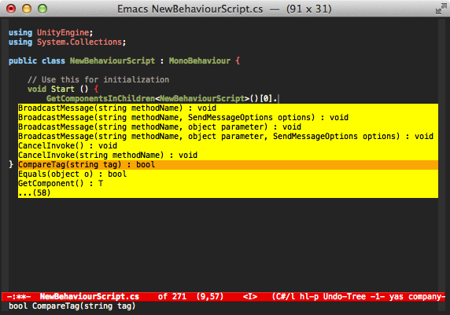

Pressing F1 with a candidate selected in the the company-mode popup
shows a buffer with documentation.

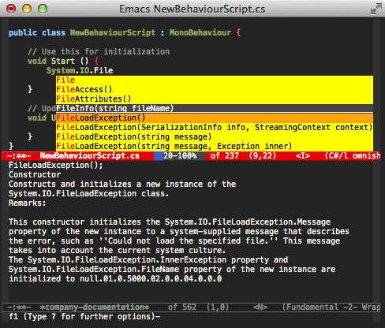

Omnisharp's company-mode support ignores case by default, but can be
made case sensitive by setting `omnisharp-company-ignore-case` to nil.

#### popup.el interface


popup.el with documentation. The documentation may be disabled if you
need the screen space. There is an option to show documentation in a
help buffer.

To (not) complete from all namespaces, use the prefix argument when
calling. This inverts the
`omnisharp-auto-complete-want-importable-types` setting temporarily.

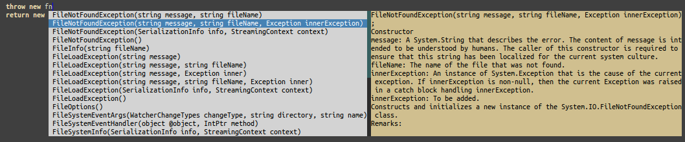

#### Ido interface

Ido allows for flexible matching of all text that the completions
have. Each pressed character will narrow the list down to fewer
options. It's also possible to do a cross search at any point with a
new search term by pressing C-SPC.

This makes it really easy to e.g. narrow the list down to members that
handle a specific type, such as bool.

To (not) complete from all namespaces, use the prefix argument when
calling. This inverts the
`omnisharp-auto-complete-want-importable-types` setting temporarily.


### Go to type in current file
This is a standard functionality in e.g. Visual Studio.
The types are shown in the order they occur in the source file.


### Go to member in current type
This too is standard in various IDEs. Using ido makes navigating fast
and intuitive.
The members too are shown in the order they occur in the source file.


### Rename
Renaming suggests the current type as a basis.


### Overriding members
When invoked, displays a list of possible override targets.

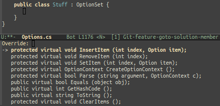

When a target is chosen, a stub member is inserted.

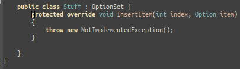

### Refactoring suggestions
For now, this must be manually invoked. It can do different things
depending on the symbol under point. In this picture it has been
invoked on a method parameter.

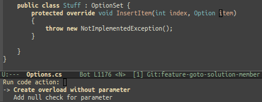

### Solution building
Here is an example of an asynchronous build within Emacs. It works by
getting the build command from the backend and executing that in the
compilation buffer.


### Syntax errors checking
It is possible to check the current buffer for syntax errors using the
flycheck library. This is done asynchronously, and errors are shown
when found. Note that this is not a type checker, only syntax is
currently checked.


To start the check, use (flycheck-mode) or select it in the
menu. The check will then be performed after the current buffer has
been idle for a certain number of seconds or when it is saved,
depending on your flycheck configuration.

To make syntax checking start sooner/later, use:
```
(setq flycheck-idle-change-delay 2) ; in seconds
```

### ElDoc integration
ElDoc support is switched on by default. This shows type information
for the symbol at point in the echo area.
To switch it off, set `omnisharp-eldoc-support` to nil.

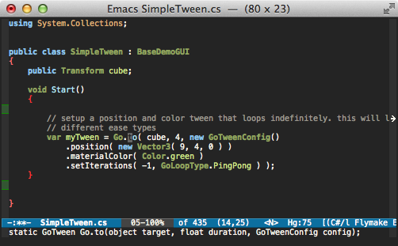

### Imenu integration
Omnisharp's Imenu support allows you to quickly view and jump to
function and variable definitions within your file. This can be used
either natively or in combination with helm-imenu
Imenu support is off by default, but can be turned on by setting
omnisharp-imenu-support to t

### Helm integration

If you have Helm installed, Omnisharp offers several
integrations. First of all, there's helm-imenu:

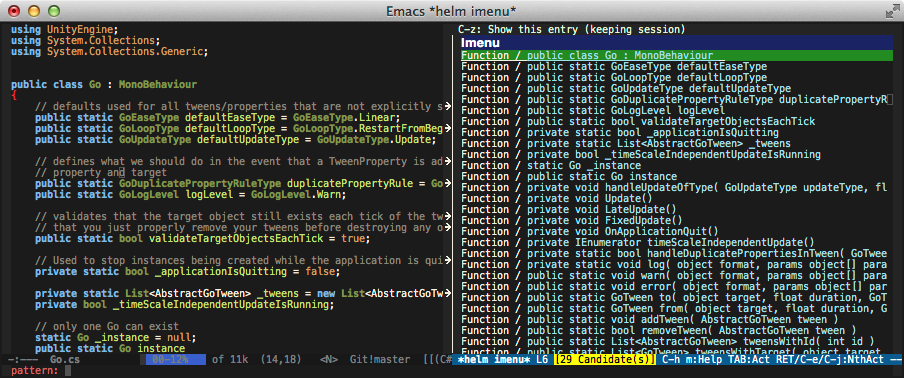

There's also 'omnisharp-helm-find-usages', which allows you to easily
navigate to references in your project:

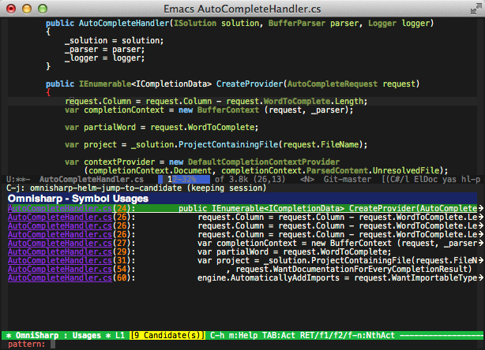

And then there's 'omnisharp-helm-find-symbols', which allows you find
and jump to any symbol in your project:

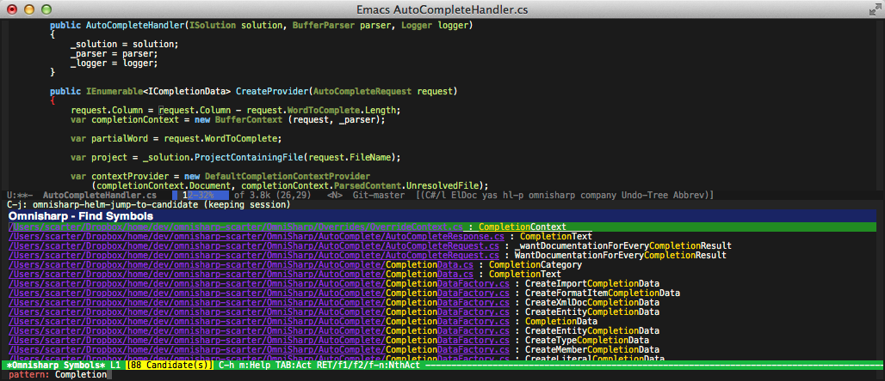


### company-mode integration

To enable company-mode autocompletion, omnisharp requires at least
version 0.7 of company-mode to be installed. Then add the following to
your init file:

```
(eval-after-load 'company
  '(add-to-list 'company-backends 'company-omnisharp))
```

company-mode completion will only trigger when omnisharp-mode is active.

### Test runner integration

Can run the test at point, fixture at point, or all tests
in project.

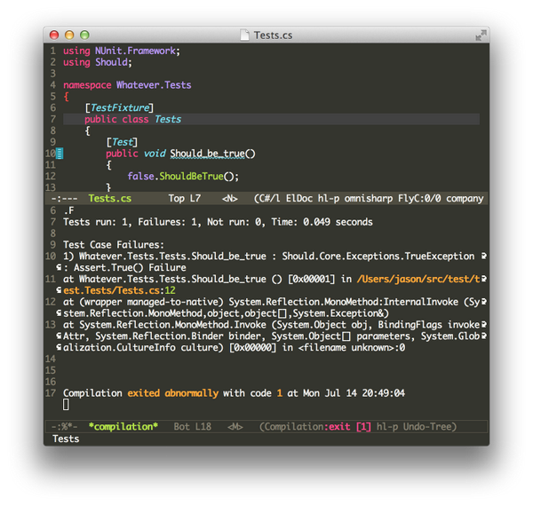

Specify the path and parameters to your test runner on the server here :-
https://github.com/nosami/OmniSharpServer/blob/0eb8644f67c020fc570aaf6629beabb7654ac944/OmniSharp/config.json#L10


## Installation

This supports Emacs 24.3 and above at least. It has been tested on
Ubuntu 12.04 (Precise), on Windows 7 and on OSX.

To install, use [MELPA][].
After MELPA is installed, use

```
M-x package-install omnisharp RET
```
to install.

omnisharp-emacs depends on the external program `curl` for accessing
the background OmniSharp server process. You need to ensure this is
installed and can be found by Emacs. On Windows you should install the
native curl program from [the curl website].

To make sure omnisharp-emacs can find your curl, make your PATH
environment variable contain the directory for curl, or set the
`omnisharp--curl-executable-path` variable to the full path to the
curl executable. The path may be e.g. `"C:\Program Files
(x86)\Git\bin\curl.exe"` or `/usr/bin/curl`.

To automatically load omnisharp-emacs when editing csharp files, add
something like this to your csharp-mode-hook:

```
(add-hook 'csharp-mode-hook 'omnisharp-mode)
```

Start an OmniSharp server process on a solution, and you should have
access to all of this program's functions. To do this, you can use
`M-x omnisharp-start-omnisharp-server` and navigate to a solution
file. This will start the server and let emacs handle the server
process's life.

If you want to start the process externally so it's not killed when
emacs is closed, see the instructions at [OmniSharp].

You probably need to create a custom configuration for accessing
omnisharp-emacs in your normal coding sessions. There is an example
configuration for evil-mode included in the project.

### Using Cygwin on Windows?
Cygwin paths need to be converted on the server side for the OmniSharp
server to handle them correctly. See the server side configuration
file [config-cygwin.json][] that has example configuration for Cygwin
environments and use the example path replacements by renaming that
file to `config.json`.

* * * * *

Pull requests welcome!

[OmniSharp]: https://github.com/nosami/OmniSharpServer
[popup.el]: https://github.com/auto-complete/popup-el
[company-mode]: http://company-mode.github.io
[ido-mode]: http://www.emacswiki.org/emacs/InteractivelyDoThings
[Flycheck]: https://github.com/lunaryorn/flycheck
[MELPA]: https://github.com/milkypostman/melpa/#usage
[the curl website]: http://curl.haxx.se/download.html
[config-cygwin.json]: https://github.com/nosami/OmniSharpServer/blob/master/OmniSharp/config-cygwin.json
