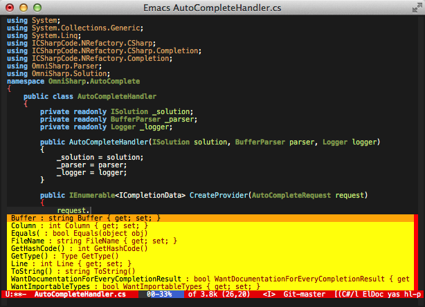
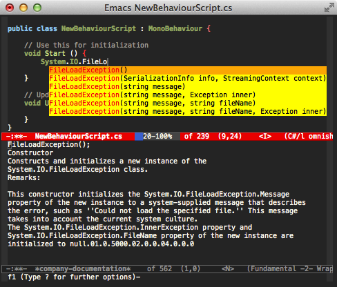

# omnisharp-emacs
<!--
disabled for now, for the roslyn version

<a href="//travis-ci.org/OmniSharp/omnisharp-emacs">
    
</a>
-->

omnisharp-emacs is a port of the awesome [omnisharp-roslyn][] server to the
Emacs text editor. It provides IDE-like features for editing files in
C# solutions in Emacs, provided by an OmniSharp server instance that
works in the background.

## Installation of the omnisharp-roslyn server application
This emacs package requires the [omnisharp-roslyn][] server program.
You can build the server yourself from the source or get precompiled 
binaries from the [omnisharp-roslyn releases](https://github.com/OmniSharp/omnisharp-roslyn/releases) page.

The server must be a recent one, e.g. at least from year 2016.
If you haven't updated your server copy since that, you must upgrade.

You can install the server from source as detailed on [omnisharp-roslyn building page](https://github.com/OmniSharp/omnisharp-roslyn#building). Or use the following instructions.

 * TODO: there are plans to add automatic server installation/update mechanism to `omnisharp-emacs` eventually. See [omnisharp-emacs#275](https://github.com/OmniSharp/omnisharp-emacs/issues/275). But for now you have to install it manually.

### On macOS with brew
<pre>
brew tap omnisharp/omnisharp-roslyn
brew update
brew install omnisharp
</pre>

Then you need to set the `omnisharp-server-executable-path`:

```lisp
(setq omnisharp-server-executable-path "/usr/local/bin/omnisharp")
```

### On linux
Extract binary from [omnisharp-roslyn releases page](https://github.com/OmniSharp/omnisharp-roslyn/releases).

### On Windows (non-Cygwin)
Use binary from [omnisharp-roslyn releases page](https://github.com/OmniSharp/omnisharp-roslyn/releases).

Then you need to set the `omnisharp-server-executable-path` the path
to where you have extracted server file, e.g.:

```lisp
(setq omnisharp-server-executable-path "C:\\Bin\\omnisharp-roslyn\\OmniSharp.exe")
```

### On Windows (with Cygwin)
Use binary from [omnisharp-roslyn releases page](https://github.com/OmniSharp/omnisharp-roslyn/releases):

 - https://github.com/OmniSharp/omnisharp-roslyn/releases/download/v1.9-beta22/omnisharp-win-x64-net46.zip
 
If I use omnisharp-roslyn net46 directly, omnisharp-emacs hangs when interacting via stdio.
This seems to be a difference in how console IO is handled in newer versions of .Net.
My workaround involves using a wrapper written in C#:

https://gist.github.com/corngood/d982c3c21c016127a2f1600dc895c000

You need to compile the wrapper against an older .net framework (3.5 seems to work). A simple way to use the wrapper is to create a shell script like:

```shell
#!/bin/sh
set -e
[path-to-wrapper-exe] "$(cygpath -w [path-to-omnisharp-exe])" "$@"
```

If you name this script OmniSharp, and put it in your path (e.g. /usr/local/bin/OmniSharp),
`omnisharp-emacs` should find it and launch omnisharp correctly.
Or you can point to it directly in your init.el

```lisp
(setq omnisharp-server-executable-path "/home/<username>/bin/OmniSharp")
```

## Package Installation and Configuration
This package requires Emacs 24.3 and above. It has been tested on
Ubuntu, Windows 7+ and on macOS.

### Installation on Spacemacs
Add `csharp` layer to `dotspacemacs-configuration-layers` on
your `.spacemacs` file. `csharp-mode` and `omnisharp` packages
will get installed automatically on restart for you.

 * TODO: as of 2017-02-19 `csharp` layer installs non-roslyn version of omnisharp-emacs.

### Installation on Regular Emacs
To install, use [MELPA][].
After MELPA is configured correctly, use

<pre>
M-x package-refresh-contents RET
M-x package-install omnisharp RET
</pre>
to install.

When installing the `omnisharp` package `package.el` will also 
automatically pull in `csharp-mode` for you as well.

To automatically load omnisharp-emacs when editing csharp files, add
something like this to `csharp-mode-hook` on your `init.el`:

```
(add-hook 'csharp-mode-hook 'omnisharp-mode)
```

## Configuration and commands available
To start it, use `M-x omnisharp-start-omnisharp-server RET`.
The command will ask you for a solution file or a directory 
you want to code in.

Emacs will manage connection to the server as a subprocess.

You will probably want to create a custom configuration for accessing
omnisharp-emacs in your normal coding sessions. There is an example
configuration for evil-mode included in the project.

## Features

* Contextual code completion (i.e. auto-complete / IntelliSense) using
  [popup.el][] or [ido-mode][] or [company-mode][] if it is installed.
  Currently popup and ido-mode can complete symbols in all namespaces
  if so configured.
    * Popup.el and company-mode provide a more sophisticated
      interface, with the possibility to fall back on all of ido's
      flexible matching power.
    * Also shows documentation like other IDEs
* Show type of the current symbol in the minibuffer. With prefix
  argument, add it to kill ring. Optional eldoc support available to
  show this automatically when point is on a symbol (see the source
  for help)
* Navigation helpers
    * Go to definition of a type/variable/method etc. With the prefix
  argument (C-u), use another window.
    * Find usages of the current symbol in the solution
    * Find implementations/derived types of the current type
    * Go to definition of a type in the current file with [ido-mode][]
      (fast).
    * Go to definition of a member in the current type with
      [ido-mode][] (likewise fast :)).
    * Go to region / endregion in current file
    * Go to any member in the solution (property, method etc.)
    * Go to file, then go to member (type, property, method) in that
      file.
* Rename the current symbol and all references to it
    * Rename only semantic references ("smart" rename)
    * Rename as verbatim text ("dumb" rename)
* Solution manipulation
    * Add/remove the current file
    * Add/remove selected files in the dired directory editor
* Override selected superclass member
* Run a refactoring on the current position
    * Uses the refactorings from the NRefactory library, which is also
      used by the MonoDevelop and SharpDevelop IDEs
    * When used with a selection, prompts to extract a method from the
      selection where possible
* Solution building
    * The user may choose whether they want to build in the emacs
      `*compilation*` buffer or at OmniSharp's end (non-asynchronous,
      that is, blocking)
    * Jump to errors like in normal `*compilation*` output
* Format the current buffer
    * Currently only one formatting style supported, easy to add more.
* Fix using statements
    * Sorts, removes and adds any missing using statements
      for the current buffer
* Syntax checker for parse errors
    * Runs using the provided [Flycheck][] checker in the background.
* Syntax checker for code issues (refactoring suggestions)
    * This automatically runs when there are no syntax errors
    * Fix the first suggested error on the current line with
      `omnisharp-fix-code-issue-at-point`
* OmniSharp server instance manipulation
    * Start server
* Test runner
  * Can run test at point, fixture or all tests in project.

## Details

### Autocompletion

#### company-mode interface

company-mode showing parameters and return values, and the selected
function description in the minibuffer. As you can see, the completion
works with non-trivial code.



Pressing F1 with a candidate selected in the the company-mode popup
shows a buffer with documentation.



Omnisharp's company-mode support ignores case by default, but can be
made case sensitive by setting `omnisharp-company-ignore-case` to nil.

#### popup.el interface


popup.el with documentation. The documentation may be disabled if you
need the screen space. There is an option to show documentation in a
help buffer.

To (not) complete from all namespaces, use the prefix argument when
calling. This inverts the
`omnisharp-auto-complete-want-importable-types` setting temporarily.


#### Ido interface

Ido allows for flexible matching of all text that the completions
have. Each pressed character will narrow the list down to fewer
options. It's also possible to do a cross search at any point with a
new search term by pressing C-SPC.

This makes it really easy to e.g. narrow the list down to members that
handle a specific type, such as bool.

To (not) complete from all namespaces, use the prefix argument when
calling. This inverts the
`omnisharp-auto-complete-want-importable-types` setting temporarily.


### Go to type in current file
This is a standard functionality in e.g. Visual Studio.
The types are shown in the order they occur in the source file.


### Go to member in current type
This too is standard in various IDEs. Using ido makes navigating fast
and intuitive.
The members too are shown in the order they occur in the source file.


### Rename
Renaming suggests the current type as a basis.


### Overriding members
When invoked, displays a list of possible override targets.


When a target is chosen, a stub member is inserted.


### Refactoring suggestions
For now, this must be manually invoked. It can do different things
depending on the symbol under point. In this picture it has been
invoked on a method parameter.


### Solution building
Here is an example of an asynchronous build within Emacs. It works by
getting the build command from the backend and executing that in the
compilation buffer.


### Syntax errors checking
It is possible to check the current buffer for syntax errors using the
flycheck library. This is done asynchronously, and errors are shown
when found. Note that this is not a type checker, only syntax is
currently checked.


To start the check, use (flycheck-mode) or select it in the
menu. The check will then be performed after the current buffer has
been idle for a certain number of seconds or when it is saved,
depending on your flycheck configuration.

To make syntax checking start sooner/later, use:
```
(setq flycheck-idle-change-delay 2) ; in seconds
```

### ElDoc integration
ElDoc support is switched on by default. This shows type information
for the symbol at point in the echo area.
To switch it off, set `omnisharp-eldoc-support` to nil.


### Imenu integration
Omnisharp's Imenu support allows you to quickly view and jump to
function and variable definitions within your file. This can be used
either natively or in combination with helm-imenu
Imenu support is off by default, but can be turned on by setting
omnisharp-imenu-support to t

### Helm integration

If you have Helm installed, Omnisharp offers several
integrations. First of all, there's helm-imenu:


There's also 'omnisharp-helm-find-usages', which allows you to easily
navigate to references in your project:


And then there's 'omnisharp-helm-find-symbols', which allows you find
and jump to any symbol in your project:


### company-mode integration

To enable company-mode autocompletion, omnisharp requires at least
version 0.7 of company-mode to be installed. Then add the following to
your init file:

```
(eval-after-load 'company
  '(add-to-list 'company-backends 'company-omnisharp))
```

company-mode completion will only trigger when omnisharp-mode is active.

### Test runner integration

Can run the test at point, fixture at point, or all tests
in project.


Specify the path and parameters to your test runner on the server here :-
https://github.com/nosami/OmniSharpServer/blob/0eb8644f67c020fc570aaf6629beabb7654ac944/OmniSharp/config.json#L10


* * * * *

Pull requests welcome!

[omnisharp-roslyn]: https://github.com/OmniSharp/omnisharp-roslyn
[popup.el]: https://github.com/auto-complete/popup-el
[company-mode]: http://company-mode.github.io
[ido-mode]: http://www.emacswiki.org/emacs/InteractivelyDoThings
[Flycheck]: https://github.com/lunaryorn/flycheck
[MELPA]: https://github.com/milkypostman/melpa/#usage
